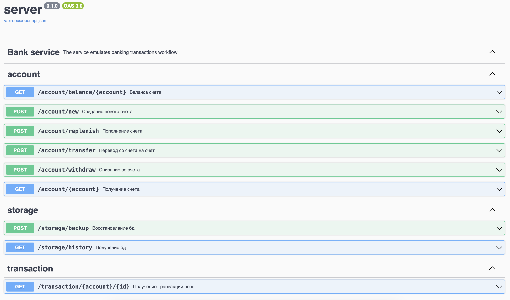

# Banking service

## Overview

Banking pet-project service.
Service allows work with:

- accounts: create, replenish, withdraw, etc...
- transactions: get one, get all, etc...
- storage: save, replicate, backup

## Content

- [Specification](#specification)
- [Example](#example)
- [Server](#server)
    - [Start](#start)
        - [Http](#http)
        - [gPRC](#grpc)
    - [Swagger](#swagger)
    - [Storage](#storage)
    - [Replication](#replication)
    - [CI](#ci)
- [Client](#client)
    - [Protocol](#Protocol)
    - [Account](#account)
        - [Create](#create)
        - [Replenish](#replenish)
        - [Withdraw](#withdraw)
        - [Transfer](#transfer)
        - [Balance](#balance)
        - [State](#state)
    - [Transaction](#transaction)
        - [Get](#get)
    - [Storage](#storage)
        - [History](#history)
        - [Backup](#backup)

## Specification

Реализовать библиотеку предоставляющую базовый банковский функционал:

1. Создавать счёт.
2. Пополнять счёт и снимать с него деньги.
3. Переводить деньги со одного счёта на другой.
4. Предоставлять историю операций.

   Подробности:

   `Счет`:

5. На счету хранятся деньги - целое число.
6. Счёт имеет имя - уникальный идентификатор.
7. Перед выполнением любых операций по счёту, его необходимо создать.
8. Выполнение операции с несуществующим счётом - ошибка.
9. Если счёт с именем Х существует, то создание нового счёта с именем Х - ошибка.
10. Клиент может получить свой баланс.

    `Пополнение`:

11. Пополнение увеличивает количество денег на счете на указанную сумму.
12. Пополнение на ноль денежных единиц - ошибка.

    `Снятие`:

13. Снятие уменьшает количество денег на счете на указанную сумму.
14. Снятие нуля денежных единиц - ошибка.
15. Попытка снять больше чем есть на счете - ошибка.

    `Переводы`:

16. Перевод уменьшает баланс отправителя и увеличивает баланс получателя на указанную сумму.
17. Перевод нуля денежных единиц - ошибка.
18. Перевод самому себе - ошибка.
19. Если сумма перевода больше баланса отправителя - ошибка.

    `История операций`:

20. Каждая операция (регистрация счёта, пополнение, снятие, перевод) должна сохраняться.
21. Каждая успешная операция возвращает уникальный идентификатор, по которому данные об этой операции могут быть в
    дальнейшем запрошены.
22. Можно получить всю историю операций.
23. Можно получить историю операций связанных с конкретным счётом. Если в истории всего M операций, а со счётом X
    связано N операций, то получение всех операций связанных со счётом X должно выполняться за O(N), а не за O(M). Иными
    словами, обычно M много больше N, поэтому мы должны хранить индекс операций по пользователям.
24. Операции должны храниться в порядке их выполнения.
25. Есть возможность восстановить состояние счетов, повторно выполнив все операции из истории в новом экземпляре банка.
    После этого новый экземпляр банка должен совпадать с тем, историю которого мы использовали.

    `Требования`:

- Библиотека реализует весь описанный функционал.
- Весь функционал протестирован.
- Приведён пример использования библиотеки.
- Все публичные методы задокумментированы. Документационные комментарии содержат тесты.
- Библиотека предосталяет данные о каждой произошедшей ошибке.
- ""cargo clippy"" и ""cargo fmt --check"" не выдают предупреждений и ошибок.
  `Дополнительные задачи (по желанию):`
- Счёт - обобщённый тип, реализацию которого выбирает клиент библиотеки.
- За все операции взымается комиссия и добавляется на специальный счёт.
- Банк хранит данные в базе данных (Redis, SQLite, ...).

## Example
Example of usage

```rust
#[tokio::main]
async fn main() -> Result<(), Box<dyn std::error::Error>> {
    /* пример http вызова */
    let invoker = HttpInvoker::new();
    // создание счета 
    let account = invoker.account.create().await.unwrap();
    println!("{:#?}", account);
    // поплнение счета
    let replenish_tx = invoker
        .account
        .replenish(account.account_id, 100_f64)
        .await
        .unwrap();
    println!("{:#?}", replenish_tx);

    /* пример gPRC вызова */
    let invoker = GRPCInvoker::new().await;
    // создание счета
    let account = invoker.account.create().await?;
    println!("Response: {:?}", account.get_ref());
    // поплнение счета
    let replenish_tx = invoker.account.replenish(account.get_ref().account_id, 100_f64).await?;
    println!("Response: {:?}", replenish_tx.get_ref());
    
    Ok(())
}
```

## Server

`Axum` - `http` webserver - https://github.com/tokio-rs/axum

`Tonic` - `gRPC` webserver - https://github.com/hyperium/tonic

## Start

### Http

To start http-service run in terminal:

```bash
make http-server
```

To customize server host and port use cli keys. Example:

```bash
cargo run -p server -- --host 0.0.0.0 --port 8000 --protocol http
```

Default values: `127.0.0.1:8080`

Server stops with `graceful shutdown`.

### gRPC

To start gRPC-service run in terminal:

```bash
make grpc-server
```

### Swagger

Swagger is available at link - http://localhost:8080/swagger/

<p align="left">
    
</p>

### Storage

Database is implemented as a `multithreading in-memory cache`.

### Replication

After starting the service, a local folder is created for replication along the `server/backup` path.

After first successful transaction creates file `server/backup/backup.json` and all successful transaction are
replicated
in it.

Db replicates in file `after every successful transaction`.

### Ci

in progress...

## Client

### Protocol

Creating a `Http` client instance:

```rust
let invoker: HttpInvoker = HttpInvoker::new();
```

Creating a `gPRC` client instance:

```rust
let invoker = GRPCInvoker::new().await;
```

For more information, see the `example`

### Account

### Create

Create new account.

The transaction is `replicated`.

### Replenish

`Replenish` money on account.

The transaction is `replicated`.

### Withdraw

`Withdrawn` money from the account.

The transaction is `replicated`.

### Transfer

`Transfer` money from account to account.

The transaction is `replicated`.

### Balance

Get account `balance`.

### State

Get `account` with all transactions.

### Transaction

Operations with transactions.

### Get

Get account `transaction`.

### Storage

### History

Get `all transactions` of all accounts (db history).

### Backup

Make db `backup` from replica file.
